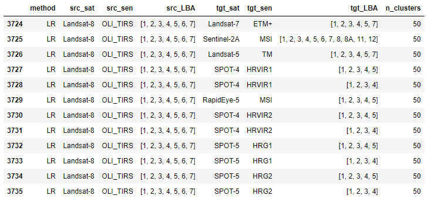

Available sensor transformations
--------------------------------

The classifiers included in the SpecHomo package
~~~~~~~~~~~~~~~~~~~~~~~~~~~~~~~~~~~~~~~~~~~~~~~~

The SpecHomo package provides a set of classifiers that can be used for spectral homogenization of various sensor
combinations (see `here <https://geomultisens.gitext-pages.gfz-potsdam.de/spechomo/doc/usage/
available_transformations.html#which-sensor-transformations-are-available>`__). These classifiers have been trained
based on simulated multispectral remote sensing images created by spectral convolution from hyperspectral airborne
datasets. These hyperspectral datasets were chosen with the intention to include as many different land-cover types
as possible in order to maximize spectral variability. This makes these classifiers suitable for many application
fields. Details on the underlying datasets and the used algorithms to create the classifiers can be found
in `Scheffler et al. 2020 <https://doi.org/10.1016/j.rse.2020.111723>`__.

Which sensor transformations are available?
~~~~~~~~~~~~~~~~~~~~~~~~~~~~~~~~~~~~~~~~~~~

SpecHomo enables you to perform spectral harmonization for various sensors - in different combinations and with
different band compositions. To get a list of all the available transformations, you may use the function
:func:`list_available_transformations<spechomo.utils.list_available_transformations>`.

.. note::

    You can directly copy/paste the outputs of this function to the method you need for running the homogenization:
    :meth:`spechomo.prediction.SpectralHomogenizer.predict_by_machine_learner()
    <spechomo.prediction.SpectralHomogenizer.predict_by_machine_learner>`. The column names of the returned
    table are consistent with this method.

Here is the code to get the full list of available transformations:

.. code-block:: python

    >>> from spechomo.utils import list_available_transformations
    >>> list_available_transformations()

The output may also be directly filtered using the input parameters of the function. Here is an example:

.. code-block:: python

    >>> from spechomo.utils import list_available_transformations
    >>> list_available_transformations(method='LR', src_sat='Landsat-8', n_clusters=50)

.. note::

    If you have trained your own classifiers for homogenization, you may also pass a different classifier root
    directory to :func:`list_available_transformations<spechomo.utils.list_available_transformations>`. Use the
    parameter `classifier_rootDir` for this.
